# Crypto AI News Processor

[](https://nodejs.org/)
[](https://opensource.org/licenses/MIT)

**Version:** 2.1.1

The Crypto AI News Processor is an application designed to monitor Telegram channels for crypto-related messages, process these messages using AI to generate concise news articles, and make this information available via a simple web interface and API endpoints.

---

## 📜 Overview

This application automates the process of news extraction and summarization from specified Telegram channels. It leverages AI models through OpenRouter to transform messages into structured articles, caches this data along with cryptocurrency prices using Redis, and presents it through a user-facing webpage and a set of RESTful APIs.

---

## ✨ Features

* **📢 Telegram Channel Monitoring:** Actively fetches new messages from a configured Telegram channel.
* **🧠 AI-Powered Summarization:** Utilizes AI models via OpenRouter to generate headlines and article summaries from message content.
* **💾 Redis Data Caching:** Stores processed articles and periodically fetched cryptocurrency prices in Redis for quick access.
* **🔢 Sequential Article IDs:** Assigns a unique, incrementing API ID to each article for stable referencing.
* **💹 Cryptocurrency Price Tracking:** Fetches and caches prices for a configurable list of cryptocurrencies.
* **🖥️ Web Frontend:** Includes a basic HTML/CSS/JavaScript frontend to display cached articles and a scrolling price ticker.
* **🔗 API Endpoints:** Exposes RESTful APIs for retrieving articles (all or by ID) and cached prices.
* **훅 Webhook Notifications (Optional):** Can POST data updates to an external URL when new articles or price changes are detected.
* **🛡️ Security & Rate Limiting:** Implements basic security headers (via Helmet) and rate limiting for API endpoints.

---

## ⚙️ How It Works

```mermaid
graph TD
    A[📱 Telegram Channel] -- Fetches Messages --> B(🚀 Application Core);
    B -- Sends Text for Summarization --> C(🤖 AI Service / OpenRouter);
    C -- Returns Structured Article --> B;
    B -- Stores Articles & Prices --> D(🗄️ Redis Cache);
    B -- Serves Data --> E[🔌 API Endpoints];
    F[💻 User Web Browser] -- Requests Page --> G(🌐 Web Frontend);
    G -- Fetches Data --> E;
```



---

## 🚀 Getting Started

For comprehensive instructions on prerequisites, setup, configuration, and deployment, please see the **[GETTING_STARTED.md](GETTING_STARTED.md)** guide.

*(For experienced developers, a "Quick Start" section might be added here in the future.)*

---

## 📡 API Endpoints

The application exposes the following API endpoints. Replace `YOUR_APP_URL` with the actual URL where the application is hosted (e.g., `http://localhost:3000`).

### 1. Get All Cached Articles

* **Endpoint:** `GET YOUR_APP_URL/api/cached-articles`
* **Description:** Retrieves all currently cached articles, sorted by Telegram message ID (newest first).
* **Response Example (`200 OK`):**
    ```json
    [
      {
        "id": 12345,
        "apiId": 1001,
        "headline": "Example Headline from AI",
        "article": "Generated article content from AI...",
        "source": "[https://original-source.url/](https://original-source.url/)",
        "date": "2025-05-28T10:00:00.000Z",
        "status": "processed"
      }
    ]
    ```

### 2. Get Specific Article by API ID

* **Endpoint:** `GET YOUR_APP_URL/api/articles/:apiId`
* **Description:** Retrieves a single article by its unique `apiId`.
* **URL Parameter:** `:apiId` (number) - The sequential API ID of the article.
* **Success Response Example (`200 OK`):**
    ```json
    {
      "success": true,
      "data": {
        "id": 12345,
        "apiId": 1001,
        "headline": "Example Headline from AI",
        "article": "Generated article content from AI...",
        "source": "[https://original-source.url/](https://original-source.url/)",
        "date": "2025-05-28T10:00:00.000Z",
        "status": "processed"
      }
    }
    ```
* **Error Responses:**
    * `400 Bad Request`: If `apiId` is not a valid number.
        ```json
        { "success": false, "error": "Invalid API ID format - must be a number" }
        ```
    * `404 Not Found`: If no article with the given `apiId` exists.
        ```json
        { "success": false, "error": "Article not found for the given API ID" }
        ```

### 3. Get Cached Prices

* **Endpoint:** `GET YOUR_APP_URL/api/cached-prices`
* **Description:** Retrieves the latest cached prices for symbols defined in the `CRYPTO_SYMBOLS` environment variable.
* **Response Example (`200 OK`):**
    ```json
    {
      "BTC": 69000.50,
      "ETH": 3500.12,
      "SOL": null
    }
    ```

---

## 📄 License

This project is licensed under the MIT License. See the [LICENSE](LICENSE) file for details.
